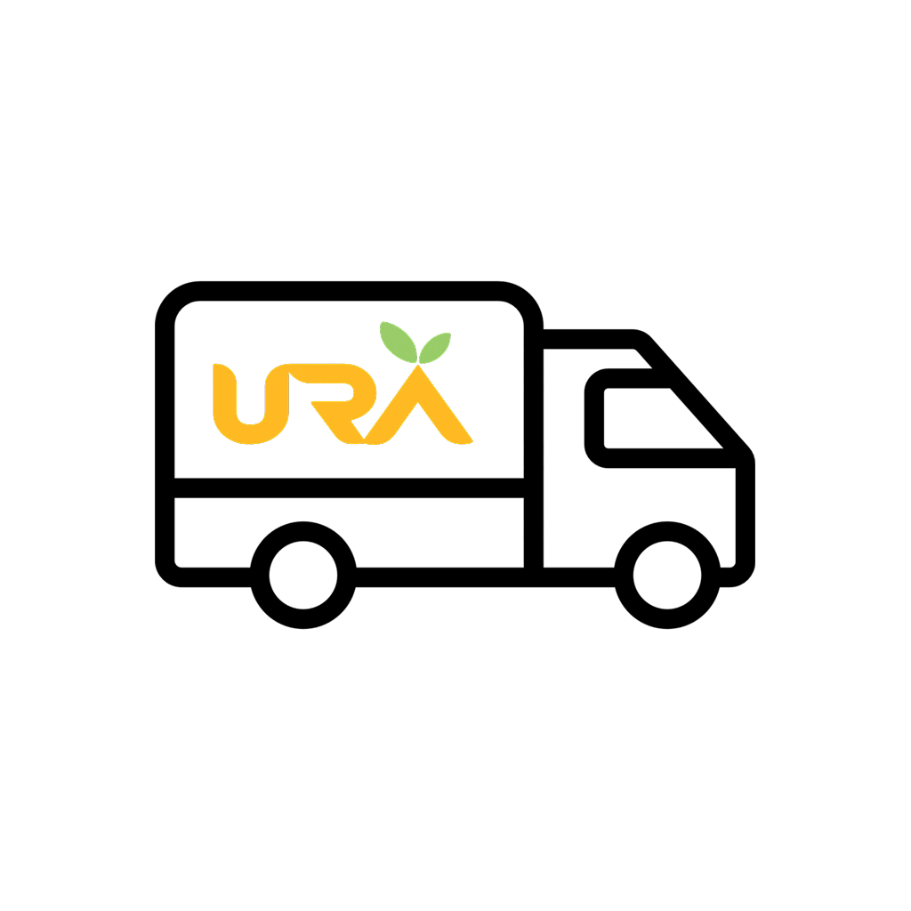

<div align="center">



# URA

**Inventory, orders, and team chat — in one app.**

[](https://github.com/AhmedRefaee/ura-core/releases/latest/download/URA.apk)
[](https://ura-core-9981c.web.app)

</div>

---

## What is URA?

URA is an internal operations app for teams that manage inventory and order
fulfillment. Different team members get a tailored view based on their role:

- **Verifier** — creates and edits orders, picks items from inventory
- **Rep** — handles sales-side orders and customer-facing tasks
- **Storage** — fulfills and tracks order packing/shipping
- **Manager** — oversees the whole pipeline: stats, approvals, monitoring

Everyone gets built-in **chat** (with image sharing) and **push notifications**
so nothing gets missed.

URA also runs in the browser at **[ura-core-9981c.web.app](https://ura-core-9981c.web.app)** —
no install needed, works on any device.

## Download (Android)

1. Tap the **Download APK** button above (or go to the
   [Releases page](https://github.com/AhmedRefaee/ura-core/releases/latest)
   and download `URA.apk`).
2. Open the downloaded file. If Android blocks it with *"For your security,
   your phone is not allowed to install unknown apps from this source"*,
   tap **Settings** in that prompt and allow installs from your browser/file
   manager — this is normal for apps installed outside the Play Store.
3. Tap **Install**, then open the app and sign in or create an account.

> URA isn't on the Play Store — installing the APK directly is the only way
> to get it for now. The app is signed with a stable release key, so future
> updates will install cleanly over the old version.

## Features

- Email/password sign-in, with organization create/join onboarding
- Role-based dashboards (Verifier, Rep, Storage, Manager, Admin)
- Inventory management with bulk Excel import/export
- Order creation, editing, and status tracking with a full audit log
- Direct and group chat with image attachments
- Push notifications for orders, chat, and approvals

## Privacy

See [PRIVACY_POLICY.md](PRIVACY_POLICY.md) for what data the app collects
and how it's used.

## For developers

Built with Flutter, [Supabase](https://supabase.com) (auth, database,
storage) and Firebase Cloud Messaging (push notifications).

```bash
flutter pub get
flutter run
```

Release builds are signed locally — see `android/key.properties.example`
if you're setting up your own signing key.
